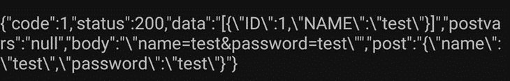
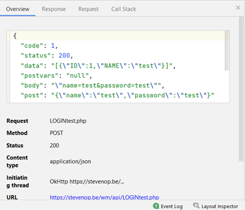
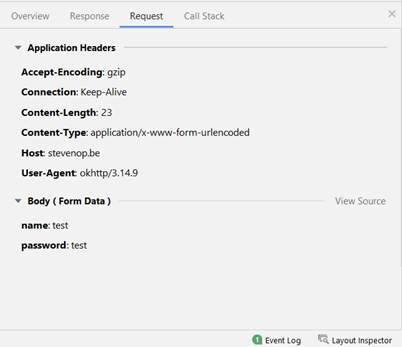

# Retrofit en POST data doorsturen naar de PHP REST API
## Inleiding
Hoewel de gebruikte cursus op https://developer.android.com/courses/android-basics-kotlin/unit-4 uitlegt hoe je een GET request kan doen, wordt hier niet uitgelegd hoe je ook POST parameters kan meegeven.

Voor meer details kijk zeker naar 
* https://square.github.io/retrofit/ (documentatie Retrofit)
* https://github.com/ophalvens/KotlinRetrofitPostTest

Een minimaal uitgewerkt voorbeeld kan je vinden op Github :
https://github.com/ophalvens/KotlinRetrofitPostTest


Het voorbeeld vertrekt van de voorbeeld PHP API die we in de cursus gebruikten. 
De aanpassingen om dit voorbeeld te laten werken, staan in het deeltje PHP beschreven. 

Om enkel op dit deel te focussen, zit in het voorbeeld geen JSON conversie met Moshi of GSON. Dat deel is analoog aan wat in de cursus stond.

### TL;DR;
* Stuur POST data door met `@FormUrlEncoded`
* In PHP haal je deze data rechtstreeks uit `$_POST` 

Deze uitleg staat ook in het pdf document [Retrofit-php.pdf](docs/Retrofit-php.pdf).

## Kotlin - Retrofit

In je “network service” :

```
package be.stevenop.kotlinretrofitposttest.network

import retrofit2.Retrofit
import retrofit2.converter.scalars.ScalarsConverterFactory
import retrofit2.http.Field
import retrofit2.http.FormUrlEncoded
import retrofit2.http.GET
import retrofit2.http.POST

/**
 * Vervang dit endpoint door het endpoint van jouw api.
 * In dit geval moet deze URI eindigen met een /
 */
private const val baseUrl = "https://stevenop.be/wm/api/"

private val retrofit = Retrofit.Builder()
    .addConverterFactory(ScalarsConverterFactory.create())
    .baseUrl(baseUrl)
    .build()

interface MyApiService {
    /**
     * Voor een get request is er niet veel speciaal aan te passen, hier volgen we
     * de cursus.
     * Let wel op : deze api is publiek, studenten kunnen producten verwijderen dus
     * het is mogelijk dat als je dit test, dat je een lege lijst krijgt. Is dat het
     * geval, voeg dan een paar producten toe via de test-app die je eerder al gebruikte.
     */
    @GET("PRODUCTSget.php")
    suspend fun getProducten() : String


    /**
     * Let bij de parameters vooral op wat je wil meegeven :
     * - de case / naam van het field : het deel tussen ("") moet overeenkomen met wat je in de API verwacht
     * - in dit geval verwacht de php api 2 velden : ("name") en ("password")
     * - de return / response is hier nog gewoon een String. Pas dit aan als je met Moshi of GSON werkt
     */
    @FormUrlEncoded
    @POST("LOGINtest.php")
    suspend fun login(
        @Field("name") name : String ,
        @Field("password") password: String
    ) : String
}

object MyApi {
    val retroFitService : MyApiService by lazy {
        retrofit.create(MyApiService::class.java)
    }
}


```

Als die Delegate by lazy niet automatisch wordt herkend, voeg dan in de module build.gradle in de dependencies het volgende toe :

`implementation "androidx.fragment:fragment-ktx:1.4.0"`

of als je met een Activity in plaats van een Fragment werkt :

`implementation "androidx.activity:activity-ktx:1.4.0"`


De call vanuit het gelinkte ViewModel :

```
private fun _login() {
    viewModelScope.launch {
        val loginResult = MyApi.retroFitService.login("test", "test")
        _status.value = loginResult
    }
}
```
In dit geval met de hardcoded name “test” en hardcoded password “test”.


## PHP
Om het inloggen te testen, is een kopie gemaakt van het bestand `LOGIN.php`, waarin de aanpassingen gedaan zijn : `LOGINtest.php`.

Het belangrijkste verschil om dit te laten werken was met Retrofit 
```
if(!$stmt->bind_param("ss", $postvars['name'], $postvars['password'])){
    …
}
```

Omzetten naar
```
if(!$stmt->bind_param("ss", $_POST['name'], $_POST['password'])){
    …
}
```

Om een beter zicht te krijgen op wat er gebeurt, is de response wat uitgebreid : we stoppen `$postvars`,`$body` en `$_POST` in `$response` : 
```
$response['postvars'] = json_encode($postvars);
$response['body'] = json_encode($body);
$response['post'] = json_encode($_POST);
$response['data'] = getJsonObjFromResult($result); 

// maak geheugen vrij op de server door de resultset te verwijderen
$result->free();
// sluit de connectie met de databank
$conn->close();
// Return Response to browser
deliver_response($response);
```
Let op : we gebruiken hier deliver_response en niet deliver_JSONresponse : 
* `deliver_response` geeft de volledige response terug :
  * 
* `deliver_JSONresponse` geeft enkel de data terug :
  * 


Zorg er wel voor dat dit niet in de productieversie van je API blijft staan. 

Om een beter zicht te krijgen op wat er gebeurt, zijn de `$postvars`, `$body` en `$_POST` aan `$response` toegevoegd, zodat je in je app kan zien wat PHP ontving in de request :


Zoals je kan zien, zitten de name en password waarden wel degelijk in de request body en in de `$_POST`, maar is de conversie van de `$body` naar de `$postvars` niet correct. 
De POST variabelen zijn echter wel rechtstreeks te halen uit de `$_POST` variabele: 

 

## Netwerk requests testen in Android Studio

Ondertussen weet iedereen hoe je in de browser je netwerkrequests via de devtools kan onderzoeken. 

Je kan ook in Android Studio onderzoeken wat je uitstuurt en ontvangt via de profiler :

1.	Open een sessie met de profiler  
2.	Je zou ongeveer het volgende scherm moeten zien : 
 
3.	Klik op de NETWORK balk zodat je inzoomt op het netwerk gedeelte
4.	Start een netwerk actie in je lopende app. In de voorbeeld app klik je bv op de TEST LOGIN knop. Je zal 1 of meer “spikes” van netwerkactiviteit zien. 
5.	Klik en sleep een rechthoek rond die netwerkactiviteit en je ziet een overzicht daaronder :
 
6.	Klik op de request, in dit geval LOGINtest.php om de details te bekijken :

 
